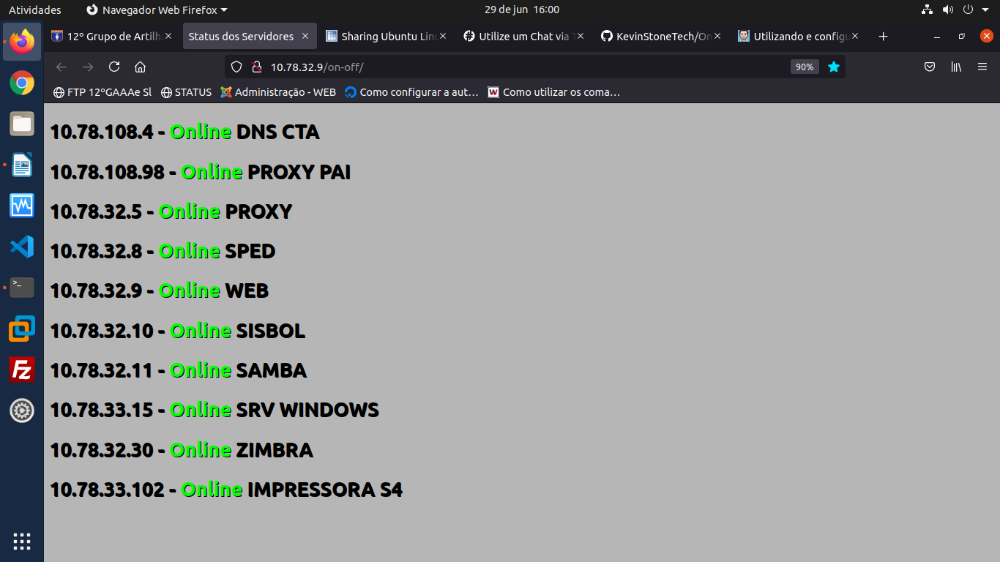

# On-Off view status

## Script para mostrar se o servidor está Online ou Offline
##
### Funcionamento:
#### *A página faz um refresh em 5 em 5 segundos, para mostrar o status do servidor ou serviço, podendo ser adapatado conforme necessidade.*

#### *Utiliza-se o IP do Servidor e a Porta do Serviço que se encontra-se ativo, para gerar o Status.*

##### Exemplo:
```$fp1 = @fsockopen("192.168.0.1", 80, $errno, $errstr, 1);

if($fp3 >= 1){

echo "<3>192.168.0.1 - <font color='#00FF00'/>Online</font> WEB<br></3>";

}else{

echo "<3>192.168.0.1 - <font color='#FF0000'/>Offline</font> WEB<br></3>";

}```

